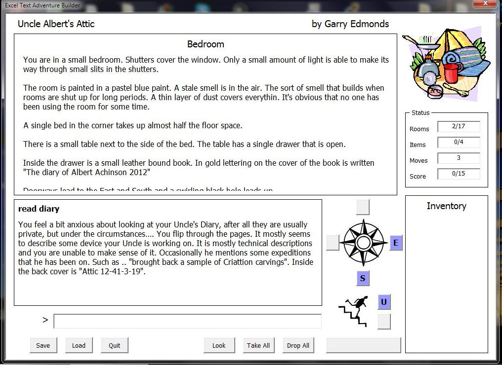

# Excel-Text-Adventure-Builder

Excel Text Adventure Builder is an interactive fiction/Text adventure game system that allows interactive fiction games to be written and played using Microsoft Excel. Game data is entered in a series of sheets. VBA macros built into the spreadsheet use the data to run the game in an excel form. Games can be created with no programming knowledge.

More information is available at https://hackshackalpha.wordpress.com/excel-text-adventure-builder/
